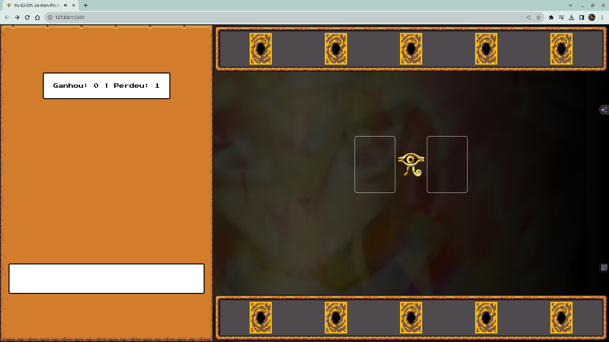
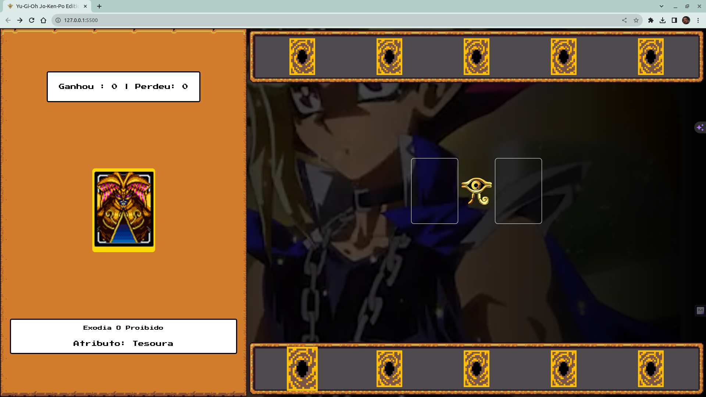

## Jogo de Cartas do Yu-Gi-Oh!
> Desafio DIO - Criando um Jogo de Cartas do Yu-Gi-Oh! com JavaScript e CSS
## 📋 Índice

- [📖 Sobre](#-Sobre)
- [🚀 Tecnologias utilizadas](#-Tecnologias-utilizadas)
- [🖥 Preview](#-Preview)
-

## 📖 Sobre
Projeto desenvolvido durante o Bootcamp [Potência Tech iFood - Desenvolvimento de Jogos](https://web.dio.me/track/potencia-tech-ifood-desenvolvimento-de-jogos). O jogo é baseado no anime Yu-Gi-Oh! Estilo pedra, papel e tesoura.

## 🚀 Tecnologias utilizadas

## 🖥 Preview:

  
  
  

